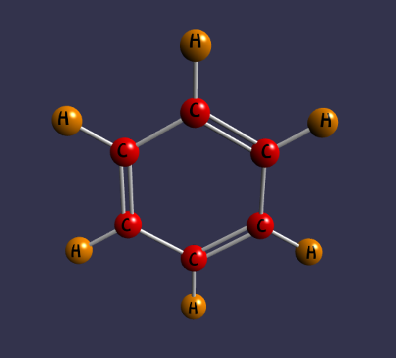

# Babylon.Blazor 
[](https://ci.appveyor.com/project/AlexNek/babylonblazor) [](https://www.nuget.org/packages/BaBylon.Blazor/)  [](https://www.nuget.org/packages/Babylon.Blazor/)

This library packages the well-known 3D library [Babylon.js](https://www.babylonjs.com/) into a Razor component that can be used in a C# Blazor project.
The library is intended to use for creation of molecules visualization and used limited API of Babylon library.  

[Demo application](https://BabylonBlazorApp202208.azurewebsites.net) - Demo for showing different parts of library 
[Pubchem Viewer](https://pubchemviewer.azurewebsites.net) - Demo application which used library reference. Show chemical information from `pubchem.ncbi.nlm.nih.gov`


## Getting Started
### Prerequisites

To create Blazor Apps, install the latest version of Visual Studio with the ASP.NET and web development workload.
For Blazor WebAssembly you need at least Visual Studio 2019 16.6+.
Another alternative would be to use Visual Studio code. Click [here](https://docs.microsoft.com/en-us/aspnet/core/blazor/get-started?view=aspnetcore-3.1&tabs=visual-studio-code) for more information.


Library requires .NET 5 or higher as I use [IJSObjectReference](https://docs.microsoft.com/en-us/dotnet/api/microsoft.jsinterop.ijsobjectreference?view=dotnet-plat-ext-6.0)


### Installing

After you have created your Blazor project, you need to do the following steps:


**Install the latest NuGet Package**

Using Package Manager
```
Install-Package Babylon.Blazor
```

Using .NET CLI
```
dotnet add package Babylon.Blazor
```

Using MS VS Manage NuGet Packages  
Search for `Babylon.Blazor`

Add reference to babylon js library. Add 2 lines into index.html
```html
<body>
    <div id="app">Loading...</div>

    <div id="blazor-error-ui">
        An unhandled error has occurred.
        <a href="" class="reload">Reload</a>
        <a class="dismiss">🗙</a>
    </div>

    <script src="https://preview.babylonjs.com/babylon.js"></script>
    <script src="https://preview.babylonjs.com/loaders/babylonjs.loaders.min.js"></script>

    <script src="_framework/blazor.webassembly.js"></script>
    <script>navigator.serviceWorker.register('service-worker.js');</script>
</body>
```

Add `InstanceCreator` to **DI**
```C#
 public class Program
    {
        public static async Task Main(string[] args)
        {
       ...
            
            builder.Services.AddScoped(sp => new HttpClient { BaseAddress = new Uri(builder.HostEnvironment.BaseAddress) });

            builder.Services.AddTransient(sp => new InstanceCreator(sp.GetService<IJSRuntime>()));
            await builder.Build().RunAsync();
        }
    }
```

Add Razor page and replace context to similar code
```C#
@page "/test"
@using Babylon.Blazor.Chemical
<h1>Water</h1>

<p> Chemical formula of water is H<sub>2</sub>O</p>

<div style="height: 600px;">
   <BabylonCanvas CanvasId="Canvas1" SceneData=@PanelData/>
</div>

@code {

    ChemicalData PanelData { get; } = new ChemicalData();

    async Task InitDataAsync()
    {
        // Fake await line
        await Task.FromResult(1);


        PanelData.Atoms.Add(new AtomDescription() { Name = "O", X = 2.5369, Y = -0.1550, Z = 0.0000 });
        PanelData.Atoms.Add(new AtomDescription() { Name = "H", X = 3.0739, Y =  0.1550, Z = 0.0000 });
        PanelData.Atoms.Add(new AtomDescription() { Name = "H", X = 2.0000, Y =  0.1550, Z = 0.0000 });

        PanelData.Bonds.Add(new BondDescription(1, 2,  BondDescription.BondType.Single));
        PanelData.Bonds.Add(new BondDescription(1, 3, BondDescription.BondType.Single));
    }

    protected override async Task OnInitializedAsync()
    {
        await InitDataAsync();
    }

}
```

Add to _Imports.razor
```
@using Babylon.Blazor
```
> **_NOTE:_**  You can skip this step

### Demo Application


For demo application I implemented: Water, Benzene and Epinephrine.
All descriptions was get from [PubChem catalog](https://pubchem.ncbi.nlm.nih.gov/).
As I not found atom size into description - I not set it. The same is for double and triple bonds - the parallel lines rotation vector mostly oriented along the Y axis. Colors selected automatically from color palette.
If chemist sees something wrong then tell me, please. My target was to create C# interface to Java script library. Not to draw molecules absolute correctly.

Water  H<sub>2</sub>O


Benzene  C<sub>6</sub>H<sub>6</sub>



Epinephrine C<sub>9</sub>H<sub>13</sub>NO<sub>3</sub>


In addition I draw some tests

Test1


Test2 (commented)  


### How it works?

With .NET 5.0 it is possible to transfer objects between Java Script and C# very easily. Call functions from JS object under C# is easy too.

You can read more in article [Using JS Object References in Blazor WASM to wrap JS libraries](https://blog.elmah.io/using-js-object-references-in-blazor-wasm-to-wrap-js-libraries/)

Here is the steps you need to wrap JS library for Blazor Web Assembly application:
1. Create Razor library with *LibraryName*.
2. Create under wwwroot js export file with functions like this:
```JavaScript
export function functionName(parameters) {
        ...
        return javaObject;
}
```
3. Create library wrapper
```C#
IJSInProcessObjectReference libraryWrapper = await _jSInstance.InvokeAsync<IJSInProcessObjectReference>("import",
                                                             "./_content/LibraryName/LibraryJSExport.js");
```
> **_NOTE:_**  You can get _jSInstance into main application over dependency injection or service provider call

4. Create C# wrapper
```C#
public async Task<CsharpObj> CsFunctionName(int parameter)
{
        var jsObjRef = await _libraryWrapper.InvokeAsync<IJSObjectReference>("jsFunctionName", parameter);
        return new CsharpObj(jsObjRef);
}
```
5. Call the wrapped function
```C#
var CsharpObj = await LibraryWrapper.CsFunctionName(2);
```
> **_NOTE:_** you can use JS object as function parameter. Use *jsObjRef* for it.

### How to create custom scene?

If you don't want to draw molecules then it is possible to create your own component
1. Create your own creator class
```C#
public class MySceneCreator : SceneCreator
{
    public override async Task CreateAsync(BabylonCanvasBase canvas)
    {
    ...
    }
}
```
2. Create Data class
```C#
public class MyCustomData:IData
{

}
```
3. Create new canvas
```C#
public class MyCustomCanvas : BabylonCanvasBase
{
       protected virtual async Task InitializeSzene(LibraryWrapper LibraryWrapper, string canvasId)
        {
            MyCustomData panelData;
            if (ChemicalData is MyCustomData)
            {
                panelData = (MyCustomData)SceneData;
	            MySceneCreator creator = new MySceneCreator(LibraryWrapper, canvasId, panelData);
    	        await creator.CreateAsync(this);
            }
        }
}
```
4. Create new Rasor component
```html
@inherits MyCustomCanvas
<canvas id=@CanvasId touch-action="none" />
```
## What's New
### in Version 1.1

New features:
 - Show errors on 3D canvas
 - Added new component ChemFormulaViewer
 - Expand ChemicalData. Added new properties: ErrorText, MolecularFormula, Name, ShowErrorText

### in Version 1.2

 - added single color Box
 - added Torus
 - added sample of custom scene drawing  
 

### in Version 1.3

 - added sprite manager
 - added sprite with base attributes
 - added callback function sample JS to .NET 
 - added sprite sample  
 


##Developer notes

If you want to change the library then don't use IIS express by debugging because JS files will be not easy to change.

In some cases you can try to refresh the site from developer mode and disabled cache


